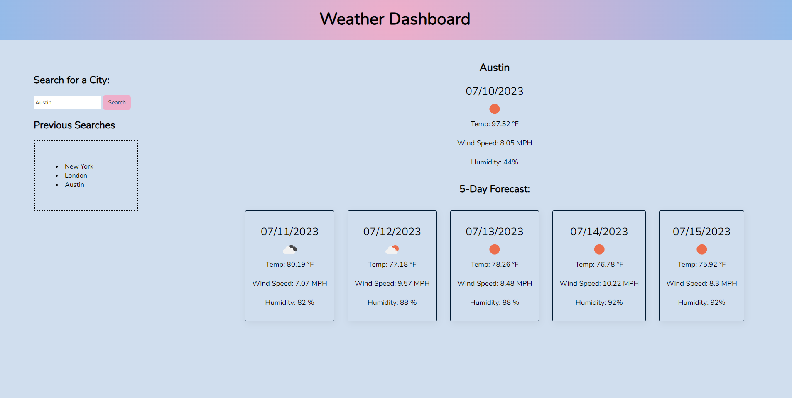

# Weather Dashboard

# Description
This Weather Dashboard is a web application that allows users to search for a city and view its current weather conditions as well as the 5-day forecast. The dashboard provides a user-friendly interface and presents the information in a clear and organized manner.

# How to Use
* Open the Weather Dashboard web application in your preferred web browser.
* Enter the name of a city in the search input field.
* Click the search button or press Enter to retrieve the weather information for the entered city.
* The current weather conditions will be displayed, including the city name, date, weather icon, temperature, humidity, and wind speed.
* Scroll down to view the 5-day forecast, which shows the date, weather icon, temperature, wind speed, and humidity for each day.

# Technologies Used 
The Weather Dashboard is built using the following technologies:

* HTML
* CSS
* JavaScript
* OpenWeather API: Used to fetch the weather data based on the user's search input.
* Day.js: JavaScript library for manipulating dates and displaying them in a user-friendly format.

# Visual

# Deployment
https://brenda255.github.io/weather-dashboard/ 